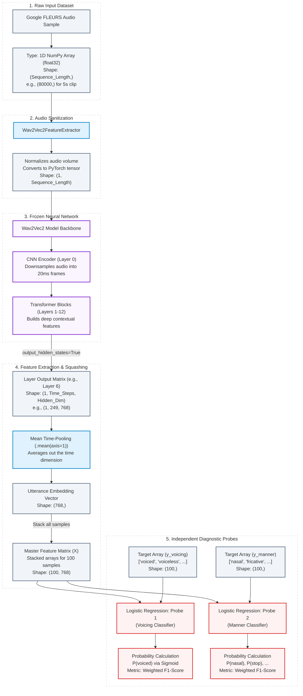

```mermaid
graph TD
    %% Global Styles
    classDef data fill:#f1f5f9,stroke:#64748b,stroke-width:2px;
    classDef process fill:#e0f2fe,stroke:#0284c7,stroke-width:2px;
    classDef model fill:#faf5ff,stroke:#7e22ce,stroke-width:2px;
    classDef probe fill:#fef2f2,stroke:#dc2626,stroke-width:2px;

    %% STAGE 1: RAW DATA
    subgraph Stage1 [1. Raw Input Dataset]
        A[Google FLEURS Audio Sample]:::data
        A1["Type: 1D NumPy Array (float32)<br>Shape: (Sequence_Length,)<br>e.g., (80000,) for 5s clip"]:::data
        A --> A1
    end

    %% STAGE 2: FEATURE EXTRACTOR
    subgraph Stage2 [2. Audio Sanitization]
        B[Wav2Vec2FeatureExtractor]:::process
        B1["Normalizes audio volume<br>Converts to PyTorch tensor<br>Shape: (1, Sequence_Length)"]:::data
        A1 --> B --> B1
    end

    %% STAGE 3: SSL MODEL PROCESSING
    subgraph Stage3 [3. Frozen Neural Network]
        C[Wav2Vec2 Model Backbone]:::model
        C1["CNN Encoder (Layer 0)<br>Downsamples audio into 20ms frames"]:::model
        C2["Transformer Blocks (Layers 1-12)<br>Builds deep contextual features"]:::model
        
        B1 --> C
        C --> C1 --> C2
    end

    %% STAGE 4: HIDDEN STATE EXTRACTION
    subgraph Stage4 [4. Feature Extraction & Squashing]
        D["Layer Output Matrix (e.g., Layer 6)<br>Shape: (1, Time_Steps, Hidden_Dim)<br>e.g., (1, 249, 768)"]:::data
        E["Mean Time-Pooling (.mean(axis=1))<br>Averages out the time dimension"]:::process
        F["Utterance Embedding Vector<br>Shape: (768,)"]:::data
        G["Master Feature Matrix (X)<br>Stacked arrays for 100 samples<br>Shape: (100, 768)"]:::data

        C2 -->|output_hidden_states=True| D
        D --> E --> F -->|Stack all samples| G
    end

    %% STAGE 5: INDEPENDENT LINEAR PROBES
    subgraph Stage5 [5. Independent Diagnostic Probes]
        H1["Logistic Regression: Probe 1<br>(Voicing Classifier)"]:::probe
        H2["Logistic Regression: Probe 2<br>(Manner Classifier)"]:::probe
        
        Y1["Target Array (y_voicing)<br>['voiced', 'voiceless', ...]<br>Shape: (100,)"]:::data
        Y2["Target Array (y_manner)<br>['nasal', 'fricative', ...]<br>Shape: (100,)"]:::data

        Out1["Probability Calculation<br>P(voiced) via Sigmoid<br>Metric: Weighted F1-Score"]:::probe
        Out2["Probability Calculation<br>P(nasal), P(stop), ...<br>Metric: Weighted F1-Score"]:::probe

        G --> H1
        G --> H2
        Y1 --> H1
        Y2 --> H2
        
        H1 --> Out1
        H2 --> Out2
    end

    %% Section Titles Styling
    style Stage1 fill:#ffffff,stroke:#cbd5e1,stroke-width:1px,stroke-dasharray: 5 5;
    style Stage2 fill:#ffffff,stroke:#cbd5e1,stroke-width:1px,stroke-dasharray: 5 5;
    style Stage3 fill:#ffffff,stroke:#cbd5e1,stroke-width:1px,stroke-dasharray: 5 5;
    style Stage4 fill:#ffffff,stroke:#cbd5e1,stroke-width:1px,stroke-dasharray: 5 5;
    style Stage5 fill:#ffffff,stroke:#cbd5e1,stroke-width:1px,stroke-dasharray: 5 5;

```