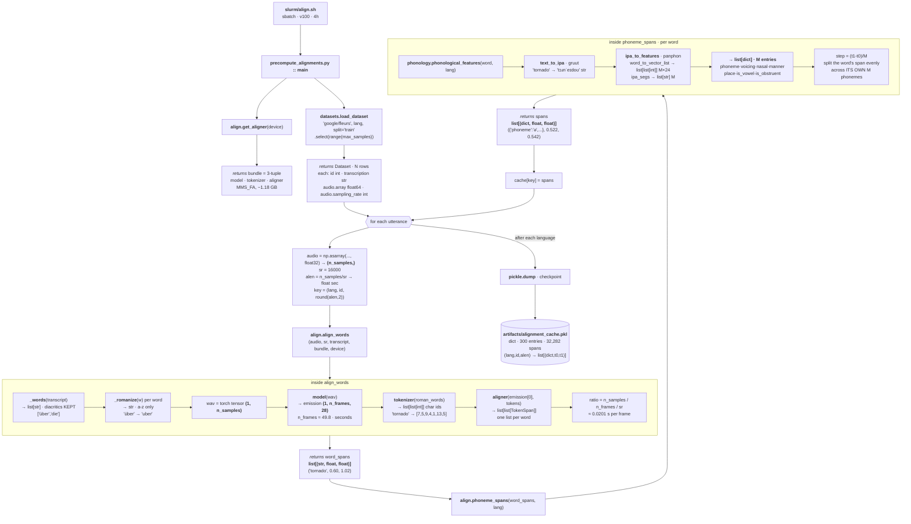

# Stage 3 deep dive — `slurm/align.sh` (forced alignment)

What runs, in what order, and the **type + shape** of every value passed between
functions. All shapes below were verified empirically against the real pipeline.

**Goal of this stage:** answer *"which audio frames does each phoneme occupy?"* and
persist the answer, so probing never needs the raw audio.

---

## Function-call flow

---

## Types and shapes at each hop

| # | Value | Type | Shape / example |
|---|---|---|---|
| 1 | `audio` | `np.float32` | `(n_samples,)` — 6.8 s → `(108800,)` |
| 2 | `sr` | `int` | `16000` |
| 3 | `alen` | `float` | `6.8` seconds |
| 4 | `key` | `tuple[str,int,float]` | `('en_us', 903, 6.8)` |
| 5 | `_words(...)` | `list[str]` | `['a','tornado','is']` — diacritics kept |
| 6 | `_romanize(w)` | `str` | `'über' → 'uber'` — a–z only |
| 7 | `wav` | `torch.float32` | `(1, n_samples)` |
| 8 | `emission` | `torch.float32` | `(1, n_frames, 28)` — 4 s → `(1, 199, 28)` |
| 9 | `tokenizer(words)` | `list[list[int]]` | `'tornado' → [7,5,9,4,1,13,5]` |
| 10 | `token_spans` | `list[list[TokenSpan]]` | one inner list per word |
| 11 | `ratio` | `float` | `≈0.0201` s/frame (**49.8 fps**) |
| 12 | `word_spans` | `list[(str,float,float)]` | `('tornado', 0.60, 1.02)` |
| 13 | `phonological_features` | `list[dict]` | M dicts, 7 keys each |
| 14 | `spans` | `list[(dict,float,float)]` | `({'phoneme':'ə',…}, 0.522, 0.542)` |
| 15 | **cache** | `dict` | 300 entries → 32,282 spans (~108/utterance) |

---

## Three things worth understanding

**1. Two text forms travel in parallel.** MMS's dictionary is **29 symbols, `a–z` + `'` `-` `*`**
— German/Spanish diacritics raise `KeyError`. But gruut *needs* the original spelling to
phonemize correctly. So `align_words` keeps them paired: the **romanized** form is fed to the
tokenizer, the **original** form is returned with the timestamps and later handed to gruut.

**2. Uniform splitting still happens — but only *within* a word.** `phoneme_spans` divides
each word's aligned span evenly across that word's phonemes. Since a word is short
(~0.4 s / ~5 phonemes) the error is small, unlike the old utterance-level uniform split
(~7 s / ~68 phonemes) which ignored silence entirely.

**3. `alen` is load-bearing, not decoration.** It is part of the cache key *and* the divisor
that converts seconds → frame index later in
`align.segment_dataset`: `f0 = int(t0 / audio_length * T)`. FLEURS reuses `id` across
speakers, so `(lang, id)` alone would collide between two different recordings of the same
sentence — `alen` makes the key recording-unique.

---

## Failure handling

- Per-utterance `try/except`: a failed alignment stores `cache[key] = []` and continues, so one
  bad clip can't kill a multi-hour job. Empty span lists are skipped later by `segment_xy`.
- **Resumable**: an existing cache is loaded at startup and keys already present are skipped.
- **Checkpointed per language**, so a walltime kill loses at most one language's work.

## Verified state

`artifacts/alignment_cache.pkl` — 300 entries (100 × 3 languages), 32,282 phoneme spans,
0 out-of-bounds (`f0 >= T`) cases, 0 empty span-lists.
