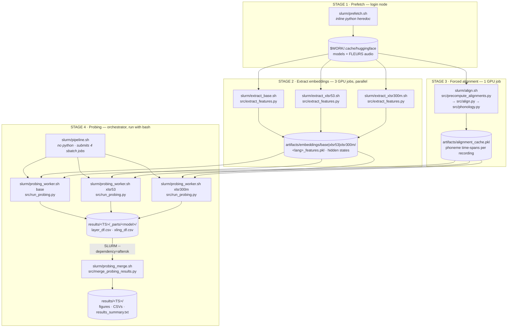

# Pipeline — execution order (fresh run)

Which shell script runs when, which Python file it calls, and what it produces.



## Commands, in order

```bash
bash   slurm/prefetch.sh              # 1. login node — warm the HF cache
sbatch slurm/extract_base.sh     100  # 2. these three can run
sbatch slurm/extract_xlsr53.sh   100  #    at the same time
sbatch slurm/extract_xlsr300m.sh 100
sbatch slurm/align.sh            100  # 3. needs FLEURS audio only
bash   slurm/pipeline.sh         100  # 4. needs stages 2 AND 3
```

> `pipeline.sh` is run with **`bash`, not `sbatch`** — it is an orchestrator that
> calls `sbatch` itself for the 3 workers plus the dependent merge job.

## Shell → Python → output

| Shell script | Python called | Output |
|---|---|---|
| `prefetch.sh` | *(inline heredoc)* | `$WORK/.cache/huggingface/` |
| `extract_base.sh`<br/>`extract_xlsr53.sh`<br/>`extract_xlsr300m.sh` | `src/extract_features.py` | `artifacts/embeddings/<tag>/<lang>_features.pkl` |
| `align.sh` | `src/precompute_alignments.py`<br/>→ `src/align.py` → `src/phonology.py` | `artifacts/alignment_cache.pkl` |
| `pipeline.sh` | *(none — submits jobs)* | `results/<TS>/run_config.txt` |
| `probing_worker.sh` ×3 | `src/run_probing.py`<br/>→ `align.py`, `probing.py`, `phonology.py` | `results/<TS>/_parts/<model>/*.csv` |
| `probing_merge.sh` | `src/merge_probing_results.py`<br/>→ reuses `run_probing.py` figure/table code | `results/<TS>/` final figures + CSVs |

## Notes

- **Stages 2 and 3 are independent** — `align.sh` reads FLEURS audio directly, not the
  embeddings, so it can run at the same time as the extraction jobs. Only stage 4 needs both.
- **Frame→phoneme mapping is always MMS forced alignment.** The old `uniform` mode (split
  each utterance's frames evenly across its phonemes) was removed along with
  `src/precompute_phonemes.py` and `artifacts/phoneme_cache.pkl`: it ignored leading silence
  and real phoneme durations, roughly halving probe scores (voicing EN 0.50 vs 0.86). The
  uniform baseline run is preserved at `results/20260706_21094441/` and in git history.
- **If a worker fails**, `--dependency=afterok` means the merge job never starts (it sits as
  `DependencyNeverSatisfied`). The surviving `_parts/` are reusable — rerun the failed model,
  then submit `probing_merge.sh` by hand.
- **Re-extracting with a different `--max-samples` invalidates the alignment cache** — it is
  keyed per recording, so new utterances have no spans and would be silently skipped. Rerun
  `align.sh` after any change to the extraction sample count.
