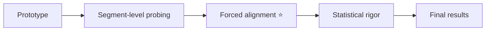

# Pipeline overview

The four steps of the project, end to end.

## What each step does

| step | input → output | how |
|---|---|---|
| **1 · Extracting hidden states** | audio → per-layer embeddings | wav2vec 2.0 over FLEURS audio |
| **2 · Extracting phonology** | text → phoneme labels + timings | IPA (gruut) → features (panphon), placed by forced alignment |
| **3 · Probing** | embeddings + labels → scores | linear probe per feature × layer × language |
| **4 · Analysis** | scores → findings | H1 / H2 / H3 with error bars & gap CIs |
