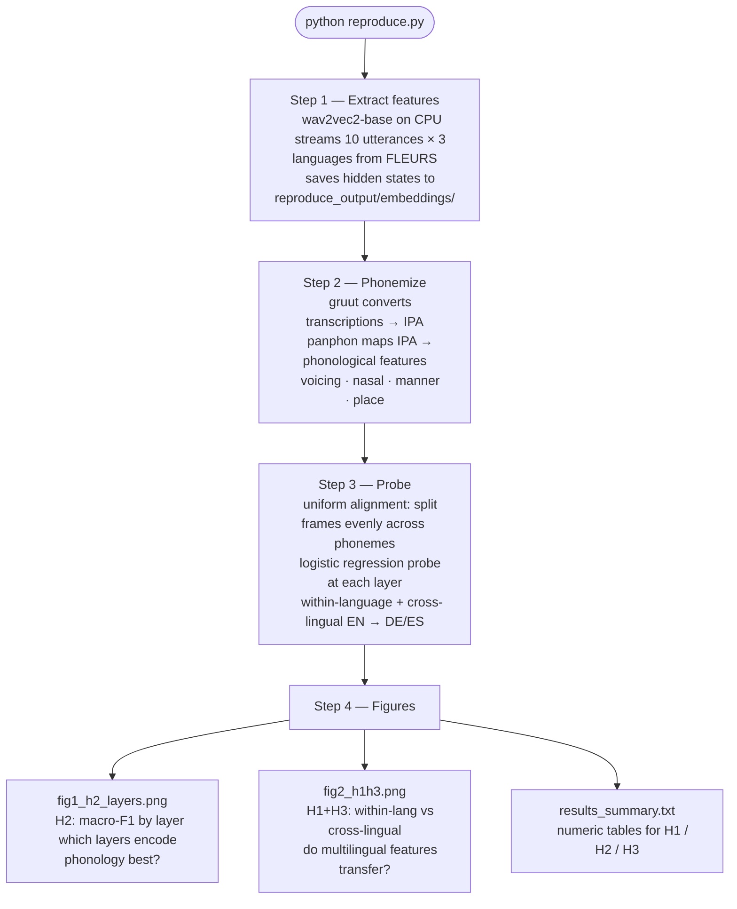

# How `reproduce.py` works



## Run it

```bash
git clone <repo>
cd BIMAP-FEATURE
pip install -r requirements.txt

python reproduce.py              # ~15 min on CPU
```

## Output

```
reproduce_output/
├── embeddings/
│   ├── en_us_features.pkl
│   ├── de_de_features.pkl
│   └── es_419_features.pkl
├── fig1_h2_layers.png
├── fig2_h1h3.png
└── results_summary.txt
```

## Notes

- No GPU needed — wav2vec2-base runs on CPU in under 15 min with 10 samples
- Uses HF streaming — no 2 GB dataset download, only the audio files needed
- Results at N=10 are directionally correct but noisy; final thesis uses N=100 with forced alignment
